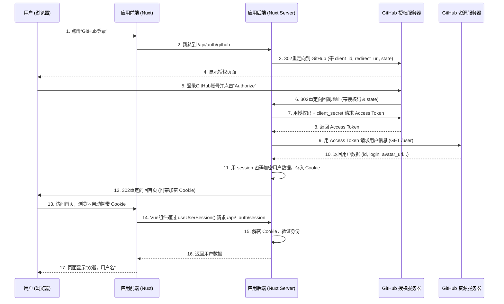

# Nuxt 4 集成 GitHub 登录：从原理到实践

本文详细讲解在 Nuxt 4 应用中集成 GitHub OAuth 登录的完整过程，涵盖 OAuth 2.0 核心原理、nuxt-auth-utils 模块的工作机制、具体实现步骤以及常见错误的根本原因分析。内容适用于希望深入理解第三方登录机制并独立实现功能的开发者。

---

## 一、OAuth 2.0 核心原理（为什么第三方登录能“认识”用户）

### 1.1 四个角色

OAuth 流程涉及四个参与者：

| 角色           | 技术名词             | 说明                                               |
| -------------- | -------------------- | -------------------------------------------------- |
| **资源所有者** | Resource Owner       | 拥有 GitHub 账号的用户                             |
| **客户端应用** | Client               | 需要访问用户 GitHub 信息的应用（即你的 Nuxt 应用） |
| **授权服务器** | Authorization Server | GitHub 的身份验证与授权端点                        |
| **资源服务器** | Resource Server      | GitHub 的 API 服务器，存储用户数据                 |

在 GitHub 的实现中，授权服务器与资源服务器属同一实体，但逻辑职责分离。

### 1.2 授权码模式核心流程

OAuth 2.0 授权码模式是最安全的流程，核心思想是：客户端应用**绝不接触用户密码**，而是通过一次性的授权码换取代表用户身份的访问令牌。

1. **引导用户**：应用将用户重定向到 GitHub 授权页，附带 `client_id`、`redirect_uri` 和 `state`。
2. **用户授权**：用户在 GitHub 登录并确认授权。
3. **返回授权码**：GitHub 将用户重定向回应用的回调地址，并在 URL 中附带授权码。
4. **换取令牌**：应用后端使用 `client_id` + `client_secret` + 授权码向 GitHub 换取 `access_token`。
5. **获取用户信息**：后端使用 `access_token` 调用 GitHub API 获取用户数据。

### 1.3 关键概念

- **client_id**：应用的公开标识，用于识别应用。
- **client_secret**：应用的私密密钥，用于后端安全通信，**严禁暴露**。
- **redirect_uri**：授权成功后 GitHub 重定向的地址，必须与注册时完全一致。
- **scope**：权限范围，指定应用可访问的用户信息（如公开资料、邮箱等）。
- **state**：防 CSRF 的随机字符串，在请求和回调中保持一致。

---

## 二、GitHub OAuth 完整交互时序



### 各步骤原理

- **步骤 2**：`/api/auth/github` 由 `nuxt-auth-utils` 提供，构造 GitHub 授权 URL 并返回 302 重定向。
- **步骤 3**：重定向 URL 包含 `client_id`、`redirect_uri` 和自动生成的 `state`。
- **步骤 6**：回调中携带授权码和 `state`，后端验证 `state` 一致性。
- **步骤 7**：后端通过 `client_secret` 换取 `access_token`，该步骤在服务器间进行，密钥不暴露。
- **步骤 11**：使用 `NUXT_SESSION_PASSWORD` 加密用户数据，存入 `HttpOnly` 的 `nuxt-session` Cookie。
- **步骤 14**：`useUserSession()` 实际调用 `/api/_auth/session`，后端解密 Cookie 返回用户信息。

---

## 三、nuxt-auth-utils 工作原理

### 3.1 Session 存储：加密 Cookie

- 调用 `setUserSession(event, data)` 时，模块利用 `NUXT_SESSION_PASSWORD` 对数据进行加密，生成 `nuxt-session` Cookie。
- Cookie 属性：`HttpOnly`（防 XSS）、`SameSite=Lax`（防 CSRF）、`Secure`（生产环境强制 HTTPS）。
- 后续请求自动携带该 Cookie，后端通过 `getUserSession(event)` 解密还原数据。

**优点**：无需数据库，适合 Serverless 部署；数据加密防篡改。  
**缺点**：Cookie 大小限制 4KB；无法主动全局使所有 session 失效。

### 3.2 前端 useUserSession

- 组件挂载时自动调用 `/api/_auth/session` 获取当前用户数据。
- 返回 `loggedIn`（计算属性，等价于 `!!user.value`）和 `user`（响应式数据）。
- 登录状态变化时自动更新。

### 3.3 为何区分 `loggedIn` 和 `user`

- 模板中可直接用 `v-if="loggedIn"` 表达登录状态，避免手动判断 `user` 是否为空。

---

## 四、从零到一实现 GitHub 登录（附原理注解）

### 4.1 安装 nuxt-auth-utils 模块

```bash
npx nuxi@latest module add auth-utils
```

**原理**：安装模块并注册服务端路由（如 `/api/auth/github`、`/api/_auth/session`）及客户端 composable。

### 4.2 配置环境变量

创建 `.env` 文件：

```ini
# 至少 32 位随机字符串，用于加密 session cookie
NUXT_SESSION_PASSWORD=你的32位以上随机密码
# GitHub OAuth 凭证
NUXT_OAUTH_GITHUB_CLIENT_ID=你的ClientID
NUXT_OAUTH_GITHUB_CLIENT_SECRET=你的ClientSecret
```

**原理**：`NUXT_SESSION_PASSWORD` 用于加密，`NUXT_OAUTH_GITHUB_*` 按模块约定自动注入 runtimeConfig。

### 4.3 在 GitHub 创建 OAuth App

1. 登录 GitHub → **Settings** → **Developer settings** → **OAuth Apps** → **New OAuth App**。
2. 填写：
   - **Application name**：应用名称（用户可见）
   - **Homepage URL**：开发环境 `http://localhost:3000`，生产环境为线上地址
   - **Authorization callback URL**：必须为 `<基础URL>/api/auth/github`
     - 开发：`http://localhost:3000/api/auth/github`
     - 生产：`https://你的域名/api/auth/github`
     - 可添加多个，用换行分隔

3. 注册后复制 **Client ID**，生成 **Client Secret** 并立即保存。

**原理**：回调 URL 是安全锚点，必须与注册完全一致；可添加多个以支持不同环境。

### 4.4 配置 nuxt.config.ts

```ts
export default defineNuxtConfig({
  modules: ["nuxt-auth-utils"],
  runtimeConfig: {
    oauth: {
      github: {
        clientId: "", // 留空，由环境变量注入
        clientSecret: "",
      },
    },
  },
});
```

**原理**：`runtimeConfig` 自动将 `NUXT_OAUTH_GITHUB_*` 注入对应字段，无需硬编码。

### 4.5 创建服务端路由处理回调

`server/api/auth/github.get.ts`：

```ts
export default defineOAuthGitHubEventHandler({
  async onSuccess(event, { user, tokens }) {
    // user 已通过 GitHub API 获取
    await setUserSession(event, {
      user: {
        githubId: String(user.id),
        login: user.login,
        name: user.name,
        avatarUrl: user.avatar_url,
        email: user.email,
      },
      loggedInAt: Date.now(),
    });
    return sendRedirect(event, "/");
  },
  onError(event, error) {
    console.error("GitHub OAuth error:", error);
    return sendRedirect(event, "/?auth_error=true");
  },
});
```

**原理**：`defineOAuthGitHubEventHandler` 封装了授权码交换和 token 获取；`setUserSession` 加密数据存入 Cookie。

### 4.6 添加前端登录按钮

任意组件中：

```vue
<script setup>
const { loggedIn, user, clear } = useUserSession();
const loginWithGitHub = () => {
  // 跳转到 GitHub 授权页
  navigateTo("/api/auth/github", { external: true });
};
</script>
<template>
  <div>
    <div v-if="loggedIn">
      
      <span>{{ user.name || user.login }}</span>
      <button @click="clear">登出</button>
    </div>
    <button v-else @click="loginWithGitHub">GitHub 登录</button>
  </div>
</template>
```

**原理**：`useUserSession` 自动获取用户信息；`navigateTo(..., { external: true })` 触发外部重定向；`clear()` 清除 session Cookie。

---

## 五、常见错误与根本原因

### 5.1 `redirect_uri_mismatch`

- **现象**：GitHub 返回错误“The redirect_uri MUST match the registered callback URL”。
- **原因**：实际请求的 `redirect_uri` 与 GitHub 注册的 callback URL 不完全一致（协议、域名、端口、路径必须完全相同）。
- **排查**：检查浏览器地址栏中的回调 URL，并比对 GitHub OAuth App 设置。

### 5.2 授权成功但未登录

- **现象**：GitHub 跳转回网站，但页面仍显示未登录（`loggedIn === false`）。
- **可能原因**：
  1. `setUserSession` 未执行（检查路由文件语法或异常）。
  2. `NUXT_SESSION_PASSWORD` 与加密时不一致（开发/生产环境不同）。
  3. 浏览器拒绝 Cookie（检查 Cookie 设置或 `Secure` 属性）。

### 5.3 GitHub 授权页 CSP 错误

- **现象**：控制台出现 `Content-Security-Policy` 错误。
- **原因**：GitHub 页面自身安全策略触发，通常由浏览器扩展或开发者工具注入导致，与开发者的应用无关，可忽略。

### 5.4 `useUserSession().user` 为 `undefined` 但 `loggedIn` 为 `true`

- **原因**：`setUserSession` 存储的数据结构异常（如未包含 `user` 字段），正常情况下不会发生。

### 5.5 生产环境登录失败，开发环境正常

- **排查清单**：
  - 生产域名的回调 URL 是否已添加到 GitHub OAuth App？
  - 生产服务器环境变量是否正确设置（Client ID/Secret、Session Password）？
  - 生产环境是否强制 HTTPS？（GitHub 回调要求 HTTPS，本地除外）

---

## 六、安全与扩展

### 6.1 CSRF 防护

- `nuxt-auth-utils` 自动生成并验证 `state` 参数，防止 CSRF 攻击。

### 6.2 PKCE 必要性

- 授权码模式本身已足够安全，且 GitHub 不支持 PKCE，无需额外配置。

### 6.3 获取用户邮箱

- 默认 scope 仅返回公开信息，邮箱为 `null`。如需邮箱，可在 `defineOAuthGitHubEventHandler` 中添加 `scope: ['user:email']`，并在 GitHub OAuth App 中启用相应权限。

### 6.4 增加其他登录提供商

- `nuxt-auth-utils` 支持 40+ 提供商。只需添加对应环境变量，创建相应服务端路由（如 `google.get.ts`），前端增加按钮即可。

### 6.5 存储用户信息到数据库

- 在 `onSuccess` 回调中，使用 `githubId` 查询数据库，若不存在则创建用户记录，然后将数据库用户 ID 存入 session 供后续业务使用。

---

## 七、结语

本文完整呈现了在 Nuxt 4 中集成 GitHub OAuth 的流程，涵盖从原理到实现的每一个环节。掌握这些内容后，开发者能够独立应对各类第三方登录的集成需求，并具备排查常见问题的能力。希望这份文档能成为你技术工具箱中的一份可靠参考。
