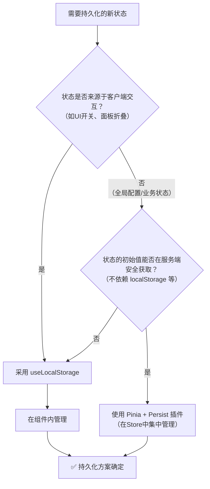

# Nuxt 4 中安全实现状态持久化：根治水合失败指南

## 问题：为什么我的页面刷新后状态会乱？

在开发 Nuxt 4 应用时，一个常见的棘手问题是：使用了 Pinia 并配置了持久化插件后，页面在生产环境刷新或在服务端渲染（SSR）时，界面状态（如侧边栏折叠、面板开关）会发生重置、闪烁，或控制台出现 `Hydration mismatch`（水合不匹配）警告。

这一切的根源，在于 **Nuxt 4 的服务端渲染（SSR）机制与浏览器特有 API（如 `localStorage`）的冲突**。

### 核心矛盾：两个世界的状态

Nuxt 4 的 SSR 流程可以简化为：

1. **服务端渲染 (Node.js 环境)**：在默认的 SSR 构建与运行环境下，此环境无法直接访问浏览器特有的全局对象，如 window、document 或 localStorage。
2. **客户端激活 (浏览器环境)**：浏览器接收到 HTML 后，会加载 Vue 等客户端脚本，将静态页面“激活”为完全可交互的应用程序。在此环境中，可以正常访问包括 localStorage 在内的所有 Web API。

**水合失败**发生在：当服务端根据一个状态（如 `false`）渲染了 HTML，但客户端使用另一个状态（如从 `localStorage` 读取的 `true`）进行激活时。Vue 会发现两边不一致，从而引发错误。

## 诊断：你的持久化状态安全吗？

状态是否安全，**不取决于它是否被持久化，而取决于它的初始值如何影响服务端渲染**。根据这个标准，我们可以将状态分为两类：

### 场景一：不影响初始渲染的“配置型”状态（通常是安全的）

这类状态在页面初次加载（SSR阶段）时，**不直接决定关键 UI 元素的显示与隐藏**。例如：

- 用户选择的**主题模式**（深色/浅色/跟随系统）
- 用户选择的**界面语言**
- 搜索范围、列表排序方式等**业务偏好**

这类状态使用 Pinia 持久化插件通常是安全的，因为它们通常通过 `useColorMode`、`useI18n` 等 **Nuxt 官方提供的、已处理 SSR 的 Composable** 来获取初始值，或者使用固定的默认值。它们不参与决定初始的 DOM 结构。

**安全示例（Pinia Store）：**

```typescript
export const useSettingsStore = defineStore(
  "settings",
  () => {
    // 使用Nuxt官方SSR安全API获取初始值
    const colorMode = useColorMode();
    const { locale } = useI18n();

    const preferences = ref({
      theme: colorMode.preference, // 初始值来自安全源
      language: locale.value, // 初始值来自安全源
      homepageLayout: "grid", // 固定的默认值
    });

    return { preferences };
  },
  {
    persist: {
      storage: piniaPluginPersistedstate.localStorage(),
      pick: ["preferences"], // 持久化这个状态
    },
  },
);
```

**安全原因**：`theme` 和 `language` 的初始值在服务端和客户端计算逻辑一致，不会导致 HTML 差异。持久化仅作用于用户后续的交互更改。

### 场景二：直接影响初始渲染的“UI状态”（高风险）

这类状态在组件**挂载时立即被用于条件渲染**（如 `v-show`、`v-if`），直接决定了某块 UI 在初始 HTML 中是否存在。例如：

- **侧边栏导航的折叠状态**
- **文章大纲面板的显示/隐藏状态**
- 信息面板的展开状态

一旦这类状态的初始值试图从 `localStorage` 读取，就会立刻触发水合问题。因为在 SSR 阶段，读取 `localStorage` 的代码会失败或返回 `undefined`。

**风险示例：**

```vue
<script setup>
// ❌ 危险！在组件顶层直接依赖 localStorage
const isSidebarCollapsed = ref(
  localStorage.getItem("sidebar-collapsed") === "true",
);
</script>

<template>
  <!-- 初始渲染直接依赖危险状态 -->
  <aside :class="{ 'w-20': isSidebarCollapsed, 'w-64': !isSidebarCollapsed }">
    ...
  </aside>
</template>
```

## 解决方案：使用 SSR 安全的 `useLocalStorage`

对于上述高风险的“UI状态”，推荐使用 `@vueuse/core` 库提供的 `useLocalStorage`。它是专门为解决此类问题而设计的。

### 使用方法

1. **安装依赖**：

   ```bash
   npm install @vueuse/core
   # 或使用 pnpm / yarn
   ```

1. **在组件中直接使用**（**这是最关键的一步**）：

   ```vue
   <script setup lang="ts">
   // 正确！导入并使用 useLocalStorage
   import { useLocalStorage } from "@vueuse/core";

   // useLocalStorage(key, initialValue)
   // 它在服务端返回 initialValue，在客户端自动连接 localStorage
   const isPanelVisible = useLocalStorage("my-app-panel-visible", true);

   const togglePanel = () => {
     isPanelVisible.value = !isPanelVisible.value;
     // 值的变动会自动同步到 localStorage，无需手动操作
   };
   </script>

   <template>
     <button @click="togglePanel">
       {{ isPanelVisible ? "隐藏" : "显示" }}面板
     </button>
     <div v-show="isPanelVisible">
       <!-- 面板内容 -->
     </div>
   </template>
   ```

### 为何这是最佳实践？

- **SSR 安全**：在服务端，它返回你提供的默认初始值，保证首次渲染正常。
- **自动同步**：在客户端，它会自动读取 `localStorage` 中的已有值并覆盖初始值，同时将任何更改写回。
- **响应式**：返回的是一个标准的 `Ref`，可以直接在模板和响应式逻辑中使用。
- **职责清晰**：状态与使用它的组件封装在一起，无需复杂的 Store 设计。

## 深入原理：从源码揭秘 useLocalStorage 如何根治水合失败

> 本分析基于 `@vueuse/core` 官方源码。它揭示的并非奇技淫巧，而是一个经典、优雅的设计范式。

要真正理解 `useLocalStorage` 为何能完美解决 SSR 中的水合问题，我们必须摒弃“延迟读取”或“生命周期控制”等模糊概念。其核心在于一种更根本的软件设计思想：**依赖注入** 与 **环境参数化**。

### 核心机制：环境感知的依赖注入

`useLocalStorage` 的源码显示，它自身**并不直接操作存储**，而是一个轻量的“适配器”：

```typescript
export function useLocalStorage<T>(
  key: MaybeRefOrGetter<string>,
  initialValue: MaybeRefOrGetter<T>,
  options: UseStorageOptions<T> = {},
): RemovableRef<any> {
  // 关键所在：通过可选链动态获取 `localStorage` 对象
  const { window = defaultWindow } = options;
  // 将 `window?.localStorage` 作为参数注入通用存储逻辑
  return useStorage(key, initialValue, window?.localStorage, options);
}
```

**真正的魔法就在 `window?.localStorage` 这一行。** 这个简单的 JavaScript 可选链表达式，是整个机制安全性的基石。

### 双环境下的精准行为剖析

让我们追踪参数 `window?.localStorage` 在不同环境下的值，以及底层 `useStorage` 函数如何响应：

#### **SSR (Node.js 服务器环境)**

1. **参数计算**：`window` 对象为 `undefined`，因此 `window?.localStorage` 的结果是 **`undefined`**。
2. **逻辑执行**：`useStorage` 函数接收到 `storage: undefined`。其内部逻辑会立即检测到这一点，并**完全跳过所有 `getItem`、`setItem` 等存储操作**。
3. **最终状态**：函数迅速返回一个以 `initialValue` 初始化的 `Ref`。整个过程**没有任何对浏览器 API 的尝试调用**，毫无副作用。

#### **CSR (浏览器客户端环境)**

1. **参数计算**：`window` 对象真实存在，因此 `window?.localStorage` 的结果是全局的 **`localStorage`** 对象。
2. **逻辑执行**：`useStorage` 函数接收到真实的 `Storage` 对象。它会**同步地**使用 `getItem(key)` 读取持久化值，并用此值覆盖 `initialValue`，然后建立监听以同步写回。
3. **最终状态**：在组件 `setup` 函数执行完毕、模板渲染之前，响应式 `Ref` 的值已经是最终状态（持久化值或默认值）。

### 与 Pinia 持久化插件的根本性对比

| 维度             | **Pinia 持久化插件**                                                                       | **`@vueuse/core` 的 `useLocalStorage`**                                                                        |
| ---------------- | ------------------------------------------------------------------------------------------ | -------------------------------------------------------------------------------------------------------------- |
| **设计模式**     | **硬编码侵入式**：在插件逻辑内部直接、强制性地调用 `localStorage.getItem()`。              | **依赖注入式**：将存储介质 (`window?.localStorage`) 作为**可选参数**向下传递。逻辑依赖于抽象，而非具体实现。   |
| **环境兼容性**   | **与环境强耦合**：代码逻辑假定 `localStorage` 全局存在，无法在无此环境的服务器端安全运行。 | **与环境解耦**：通过参数可选链 (`?.`) 在**语法层面**声明了依赖的可选性，并由底层函数在**运行时**进行安全检查。 |
| **SSR 下的行为** | 必然执行错误路径：尝试调用不存在的 API，导致报错或状态污染。                               | 执行安全路径：因关键参数为 `undefined`，逻辑短路，安全降级为纯内存状态。                                       |
| **CSR 下的行为** | 正常执行，但与 SSR 阶段产生的“脏状态”无法衔接，导致水合裂缝。                              | 正常执行，且因 SSR 阶段状态纯净（默认值），客户端激活时无缝覆盖，实现完美水合。                                |
| **问题本质**     | 违反了 **SSR 友好代码的基本原则**：在通用逻辑中直接调用了环境特定的 API。                  | 遵循了 **控制反转 (IoC) 原则**：将环境特定的依赖从核心逻辑中抽离，由外部调用者（运行时环境）决定是否提供。     |

## 设计哲学总结：为何这是“正确”的方案

`useLocalStorage` 的方案之所以正确，不是因为它更复杂，而是因为它更**简单**、更**诚实**地反映了跨环境编程的约束：

1. **诚实面对环境差异**：它不试图用一个统一的代码路径去掩盖服务器和浏览器的巨大差异，而是通过参数 (`undefined` vs `Storage Object`) 来忠实地反映这种差异。
2. **核心逻辑的纯净性**：其底层的 `useStorage` 函数的核心职责是“同步一个响应式状态与某个存储介质”。至于这个介质是 `localStorage`、`sessionStorage` 还是 `undefined`，那是调用者需要关心的事情。这种关注点分离使得核心逻辑极其健壮。
3. **利用语言特性保障安全**：`?.` 可选链操作符不仅是语法糖，更是**一种声明**——“此处的对象可能不存在”。这种在编码阶段就融入的类型与安全思维，是防御性编程的典范。

**因此，选择 `useLocalStorage` 解决水合问题，你选择的不是一个工具，而是一种经过验证的、与 SSR 架构哲学相匹配的模式：将环境特定的副作用，通过清晰的参数边界进行隔离和管理。** 这正是构建健壮的通用 Web 应用（同构应用）的核心心法。

## 决策流程图

当需要为一个状态添加持久化时，可以参考以下流程做出选择：



## 总结

要根治 Nuxt 中的状态持久化水合问题，关键在于建立 **SSR 优先的编码意识** 并 **遵循正确的设计模式**。

1. **根本原则：区分“状态”与“副作用”**

   问题的根源在于将 **状态初始化** 与 **客户端持久化副作用**（读写 `localStorage`）耦合在了一起。正确的做法是将副作用隔离。

2. **模式选择：根据状态来源决定技术方案**
   - **对于来源自客户端交互的“纯UI状态”**（如面板开关、侧边栏折叠），其初始化和持久化天然就是客户端副作用。应直接采用 **`useLocalStorage`**。它的 **依赖注入** 设计模式（通过 `window?.localStorage`）是为此场景量身定制的唯一正确解。
   - **对于来源安全的“应用配置状态”**（如从 `useI18n` 获取的语言、从 `useColorMode` 获取的主题，或固定的业务配置），其初始值在 SSR 下是安全可知的。可以继续使用 **Pinia Persist 插件** 来享受集中管理的便利，但前提是必须**确保 Store 的初始值计算逻辑完全 SSR 安全**，不蕴含任何客户端 API 调用。
3. **核心检验标准：SSR 环境下的初始值**

   在为任何状态选择持久化方案前，请**始终自问**：“在 Node.js 服务器上执行我的状态初始化代码，能否得到一个确定的、不报错的值？” 如果答案是肯定的，你才拥有选择权；如果答案是否定的，那么 `useLocalStorage` 是你唯一的安全路径。

通过将 **设计模式**（依赖注入）与 **实践标准**（SSR安全初始值）相结合，开发者不仅能解决问题，更能从根源上避免问题，写出真正健壮的通用同构应用代码。
