# Nuxt Content + i18n终极集成方案：一套内容支持多语言的完整实现

**英文标题**: Single Source, Multilingual Routes: A Seamless Integration of Nuxt Content and i18n

### 概述

在构建多语言技术文档站点时，我们常面临一个矛盾：**内容维护成本**与**多语言用户体验**如何兼得？官方方案往往建议为每种语言维护独立的文档集合，但这对于独立开发者或小团队来说负担沉重。

本文介绍一种创新方案：**只维护一套核心文档（如英文或中文），利用 `@nuxtjs/i18n` 的路由前缀功能，为用户提供完整的多语言界面体验**。访问 `/en/article` 与 `/zh_cn/article` 将显示相同的文章内容，但界面语言、导航菜单等将根据URL前缀自动切换。

### 核心优势

- **维护极简**：只需维护单一语言的内容源
- **体验完整**：用户仍能获得地址栏、导航、界面完全本地化的体验
- **技术解耦**：Content 管内容，i18n 管路由与界面，各司其职
- **无缝扩展**：未来可为特定文章添加翻译，无需改造架构

---

### 1. 问题背景：当 Content 遇上 i18n

`@nuxt/content` 模块本身提供了基础的国际化支持，但其设计初衷是**内容与语言强绑定**：

- 每个语言独立的文件夹（`/content/en/`, `/content/zh_cn/`）
- 每个语言独立的内容集合配置
- 自动回退机制：当 `/es/article` 不存在时，跳回默认语言

但这带来了两个实际问题：

1. **内容同步压力**：任何更新都需要在所有语言副本中重复
2. **架构复杂**：需要配置多个内容集合，查询时需要额外逻辑

而我们真正的需求往往是：

> “我只有精力维护一套技术文档，但希望网站支持多语言界面。”

---

### 2. 解决方案：路径转换中间层

核心思路是建立一个**路径转换层**，在用户访问时动态处理 URL：

```mermaid
graph LR
    A[用户访问<br>/ja/articles/nuxt-guide] --> B{i18n 模块};
    B --> C[识别语言前缀 ja];
    C --> D[移除前缀 /ja];
    D --> E[Content 查询 /articles/nuxt-guide];
    E --> F[返回统一内容];
    F --> G[界面元素使用 ja 语言包];
    G --> H[用户看到日文界面<br>英文内容];
```



3. 实现细节：稳定查询路径

以下是基于 Vue 3 与 Nuxt 3 的完整实现示例：

> 路由层处理

```vue
<UBlogPost
  v-for="item in fiterArticles"
  :key="item.id"
  :title="item.title"
  :description="item.description"
  :date="item.meta.date"
  class="card cursor-pointer"
  @click="navigateTo(locale === 'zh_cn' ? item.path : `/${locale}${item.path}`)"
/>
```

> 内容层：由 @nuxt/content 处理（移除语言前缀）

```typescript
<script lang="ts" setup>
import { withLeadingSlash } from "ufo";
const { locale } = useI18n();
const route = useRoute();

// 核心：移除语言前缀，得到原始路径
// 例如：/en/articles/welcome -> /articles/welcome
const slug = computed(() => {
  const path = withLeadingSlash(String(route.params.slug || "/"));
  // 移除语言前缀部分
  return path.replace(new RegExp(`^/(${locale.value})`), "") || "/";
});

// 稳定查询：永远只查询 'articles' 这个集合
const { data: page } = await useAsyncData(
  route.path,
  () => {
    return queryCollection("articles").path(`/articles${slug.value}`).first();
    // 注意：查询路径需要加上 '/articles' 前缀，以匹配 content/articles/ 下的文件
  },
  {
    // 设置 transform 确保数据一致性
    transform: (data) => {
      if (!data) return null;
      return data;
    },
  },
);
</script>
```

## 📁 推荐的目录结构

保持您的单语言内容结构：

```text
content/
  articles/
    nuxt-content-guide.md
    getting-started.md
    i18n-config.md
  about.md
```

> articles文件夹是我专门为项目建立的，无需跟我一模一样

## 🔄 路由映射关系

| 访问 URL                     | i18n 处理  | Content 查询           | 实际文件                         |
| ---------------------------- | ---------- | ---------------------- | -------------------------------- |
| `/zh_cn/articles/nuxt-guide` | 识别为中文 | `/articles/nuxt-guide` | `content/articles/nuxt-guide.md` |
| `/en/articles/nuxt-guide`    | 识别为英文 | `/articles/nuxt-guide` | `content/articles/nuxt-guide.md` |
| `/ja/articles/nuxt-guide`    | 识别为日文 | `/articles/nuxt-guide` | `content/articles/nuxt-guide.md` |

### 总结

通过 `@nuxtjs/i18n` 的路由前缀与 `@nuxt/content` 的路径转换相结合，我们实现了：

1. **维护成本最小化** - 单一内容源
2. **用户体验最大化** - 完整的多语言界面支持
3. **查询稳定性** - 使用固定的内容集合查询，避免路径解析问题

这种模式特别适合：

- 技术文档、API参考
- 个人技术博客
- 初创公司产品文档
- 任何需要快速支持多语言但翻译资源有限的场景

---

_本文采用所述方案编写，访问 `/en/articles/single-content-multilingual-routes` 或 `/zh_cn/articles/single-content-multilingual-routes` 可体验实际效果。_
